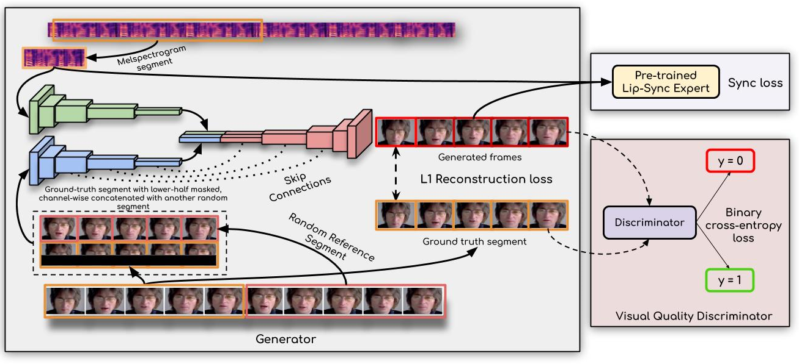

# Lip Syncing

We use [Wav2Lip](https://github.com/Rudrabha/Wav2Lip) to sync lip movements to what's actually being said. 

> 
>
> *Architecture for generating speech from lip movements*
>
> Our approach generates accurate lip-sync by learning from an "already well-trained lip-sync expert". Unlike previous works that employ only a reconstruction loss or train a discriminator in a GAN setup, we use a pre-trained discriminator that is already quite accurate at detecting lip-sync errors. We show that fine-tuning it further on the noisy generated faces hampers the discriminator's ability to measure lip-sync, thus also affecting the generated lip shapes.
>
> -- [Prajwal Renukanand, Rudrabha Mukhopadhyay, Vinay Namboodiri, and C.V. Jawahar](http://cvit.iiit.ac.in/research/projects/cvit-projects/a-lip-sync-expert-is-all-you-need-for-speech-to-lip-generation-in-the-wild/)

## Pre-Requisites

1. A Google Account that can utilize [Google Drive](https://www.google.com/intl/en_ca/drive/) and [Google Colab](https://colab.research.google.com/)

2. A `.mp4` file of the video that you want to be lip synced

   1. To find good videos to lip sync you can search through [YouTube](https://www.youtube.com/).  If you're looking for celebrities, you're more likely to find quality videos by looking for talks, podcasts, movie clips, or speeches that the person is a part of.  Once you find a video or a segment of a video that you think would work well you can go to a website, such as [KapWing](https://www.kapwing.com/studio/editor/trimmer), to convert the video into a `.mp4`.  If only a segment of the video would work well for lip syncing you can use the aforementioned website's "Trim" feature in the right panel of their website.

   

   > NOTE: The easiest videos for this are ones that contain only one face.  Multiple faces may make it switch which face is being lip synced or just lip sync the wrong face the entire time.  If the video needs to have multiple faces in it, Wav2Lip does allow you to override this auto-selecting face behavior by manually specifying coordinates in pixels for the face you want lip synced.

   > NOTE: If possible use videos that are *at most* 2 minutes long.  Using videos that are longer than that may be too much for Google Colab's free version to handle.

3. A `.wav` file of the audio that you want the video to be lip synced to

   > NOTE: The length of the video file and the length of the `.wav` file *do not* need to be the same length.  It's preferable to have a video that's slightly longer than audio clip chosen.  Reason being, the video that Wav2Lip generates as output will stop at the end of the audio clip.  So, if the video clip is shorter than the audio clip then Wav2Lip will restart the video from the beginning to finish the lip syncing, which is very jarring.  Whereas if the video is longer than the audio clip, the rest of the video will automatically be cut out after the audio clip finishes.

4. Download the [pre-trained model for face detection](https://drive.google.com/file/d/1vkiZIQr3tc8uDNNsuJIyaSrLasSHVOit/view?usp=sharing)

## Generate a Lip Synced Video 

1. Navigate to [your Google Drive](https://drive.google.com/drive/my-drive) while signed into your Google account

2. Right-click in your drive and click "New Folder" to add a folder

3. Name the folder "Wav2Lip" 

   > NOTE: the casing of "Wav2Lip" is important here, Google Colab will not recognize the folder if the casing differs.

4. Navigate into the "Wav2Lip" folder

5. Copy the `.wav` file you chose in the pre-requisites into the "Wav2Lip" folder

6. Rename the `.wav` to `input_audio.wav`

7. Copy the `.mp4` file you chose in the pre-requisites into the "Wav2Lip" folder

8. Rename the `.mp4` to `input_vid.mp4`

9. Copy the pre-trained model you downloaded in the pre-requisites into the "Wav2Lip" folder

10. Rename the pre-trained model to `wav2lip_gan.pth`

11. Navigate to the [Google Colab project](https://colab.research.google.com/drive/1czSvlyQWnlFjCQTUKub97PcHNZpxEvOp#scrollTo=yJ5taGmPcWV-)

12. Follow the steps laid out in the Google Colab project from the previous step

# Subtitles

## Generate

1. Navigate to [YouTube](https://www.youtube.com)
2. Upload the voice cloned video
3. Navigate to [YouTube Studio](https://studio.youtube.com/)
4. Click on "Content" in the left panel
5. Click on the video you just uploaded
6. Click on "Subtitles" in the left panel
7. Click the "Add Language" button
8. Choose "English" from the resulting menu
9. Hover over the language subtitle item you just added
10. Click on the hamburger menu on the right side of the hovered language subtitle item
11. Click the "Download" button
12. Click the ".srt" option from the resulting menu

## Create Video with Subtitles

1. Navigate to [KapWing](https://www.kapwing.com/studio/editor)
2. Click the "Upload" button in the top left of the application
3. Upload the video file from your local system or paste the link to the YouTube video
4. After the video is uploaded to KapWing, click "Subtitles" towards the top of the application
5. Click the "Upload.SRT" button
6. Choose the SRT file you generated from the YouTube video
7. Tweak the subtitles to your liking through KapWing's UI
   1. Change the font size, color, weight, positioning, and more in the left panel
   2. Change the text of the subtitles by clicking on it in the right panel
   3. Change the timing of when the subtitle appears by either dragging the dots or by clicking on the "Set to current time" text field and using the up and down keys on your keyboard
8. Click "Done"
9. Click "Export Video"
10. Once it has finished generating the video, click the "Download" button

