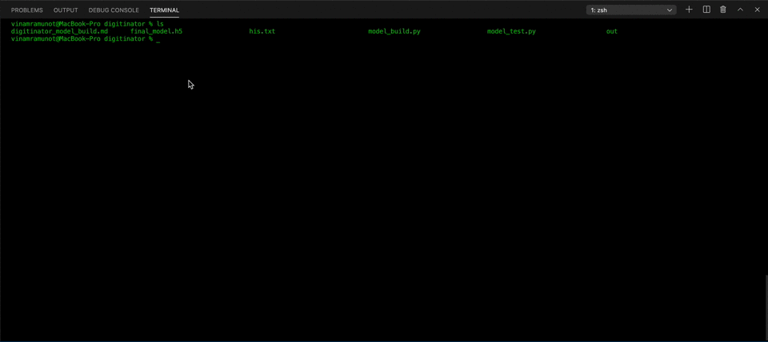
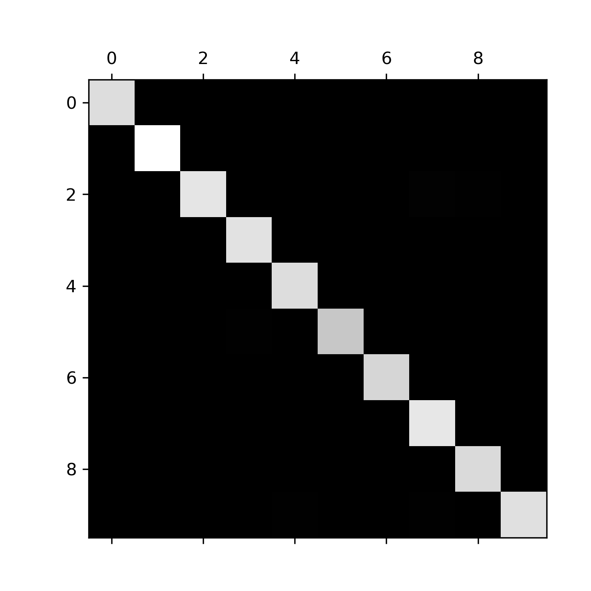
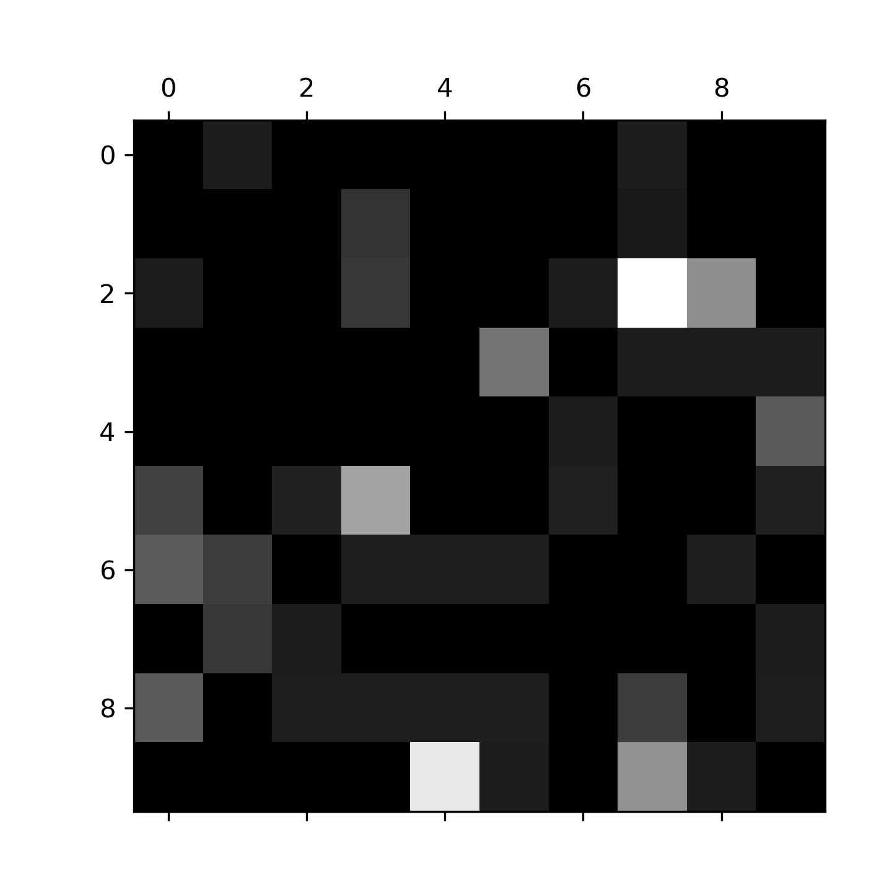

:warning: Python3.7 or above but below 3.9

# pip requirements
* tensorflow `pip install tensorflow` or `pip3 install tensorflow`
* tensorflowjs[wizard] `pip install tensorflowjs[wizard]` or `pip3 install tensorflowjs[wizard]`

# Run Build
`python model_build.py` or `python3 model_build.py`

# Run Test
`python model_test.py` or `python3 model_test.py`

# Convert Keras model to JSON
```bash
mkdir out
tensorflowjs_wizard
```
> tensorflow_wizard is a program that helps us to convert a .h5 model file into json. Sample video shown below on how to use this program.



---

The [documentation](#reference-doc) can be broken down into two important pieces:
1. [Building the model](#building-the-number-detection-model) 
2. [Testing the number detection model](#testing-the-number-detection-model)

---

# Time for Model Creation and Model testing
> Program running on CPU!
1. Model Creation: 312.67 seconds or 5.2 mins
2. Model Testing: 1.95 seconds or 0.0325 mins

---

# Building the number detection model
## Running model_build.py
1. The process starts at `run_build`
2. The process `load_dataset()` is called:
    - mnist (handwritten digits) dataset is loaded into (trainX, trainY), (testX, testY)
    - reshape the training dataset to 28px to 28px
    - reshape the testing dataset to 28px to 28px
    - using `to_categorical()` to convert the trainY into a binary matrix
    - using `to_categorical()` to convert the testY into a binary matrix
    - return trainX, trainY, testX, testY
3. The process of preparing the pixels `prep_pixels()` is called:
    - convert the train and test data to type float32
    - divide the train and test return from the previous step by 255.0 to get the average
    - return train and test data
4. Creating Model
    - `define_model()` is called
        1. This creates CNN architecture
        2. `model.compile()` set configuration of the model with losses and metrics
5. Training the model using `model.fit()`
6. Save the Keras type model in `.h5` format using `model.save()`

> HDF5 file stands for Hierarchical Data Format 5. It is an open-source file which comes in handy to store large amount of data. As the name suggests, it stores data in a hierarchical structure within a single file. So if we want to quickly access a particular part of the file rather than the whole file, we can easily do that using HDF5. HDF5 lets you store huge amounts of numerical data, and easily manipulate that data from NumPy. For example, you can slice into multi-terabyte datasets stored on disk, as if they were real NumPy arrays. Thousands of datasets can be stored in a single file, categorized and tagged however you want.

# Testing the number detection model
## Running model_test.py
1. The process starts at `run_test`
2. The process `load_dataset()` is called:
    - mnist (handwritten digits) dataset is loaded into (trainX, trainY), (testX, testY)
    - reshape the training dataset to 28px to 28px
    - reshape the testing dataset to 28px to 28px
    - using `to_categorical()` to convert the trainY into a binary matrix
    - using `to_categorical()` to convert the testY into a binary matrix
    - return trainX, trainY, testX, testY
3. The process of preparing the pixels `prep_pixels()` is called:
    - convert the train and test data to type float32
    - divide the train and test return from the previous step by 255.0 to get the average
    - return train and test data
4. Loading Model
    - `load_model()` is called to load the model that was saved during the building process
5. Classification report
    - `yPred` is created after predicting using `testX` sample
    - `yTest_original` is created from `testY`
    - `classification report` and `confusion matrix` created from sklearn.metrics using `classification_report()` and `confusion_matrix()` functions
    - `norm_conf_mx` is the confusion matrix error plot created using dividing the confusion `conf_mx` by the `row_sum`
    - image of confusion matrix and confusion matrix error plot are saved using `save_fig` function
6. Testing the model using `model.evaluate()` which returns the list of scalars. These scalars contain the accuracy of the model which is returned as `acc`

---

# Accuracy of the model
Model accuracy: 99.170%

---

# Confusion Matrix

```
[[ 978    1    0    0    0    0    0    1    0    0]
 [   0 1132    0    2    0    0    0    1    0    0]
 [   1    0 1014    2    0    0    1    9    5    0]
 [   0    0    0 1003    0    4    0    1    1    1]
 [   0    0    0    0  978    0    1    0    0    3]
 [   2    0    1    5    0  882    1    0    0    1]
 [   3    2    0    1    1    1  949    0    1    0]
 [   0    2    1    0    0    0    0 1024    0    1]
 [   3    0    1    1    1    1    0    2  964    1]
 [   0    0    0    0    8    1    0    5    1  994]]
```



# Confusion Matrix error plot

```
[[0.         0.00102041 0.         0.         0.         0.        0.         0.00102041 0.         0.        ]
 [0.         0.         0.         0.00176211 0.         0.        0.         0.00088106 0.         0.        ]
 [0.00096899 0.         0.         0.00193798 0.         0.        0.00096899 0.00872093 0.00484496 0.        ]
 [0.         0.         0.         0.         0.         0.0039604 0.         0.0009901  0.0009901  0.0009901 ]
 [0.         0.         0.         0.         0.         0.        0.00101833 0.         0.         0.00305499]
 [0.00224215 0.         0.00112108 0.00560538 0.         0.        0.00112108 0.         0.         0.00112108]
 [0.00313152 0.00208768 0.         0.00104384 0.00104384 0.0010438 0.         0.         0.00104384 0.        ]
 [0.         0.00194553 0.00097276 0.         0.         0.        0.         0.         0.         0.00097276]
 [0.00308008 0.         0.00102669 0.00102669 0.00102669 0.0010266 0.         0.00205339 0.         0.00102669]
 [0.         0.         0.         0.         0.00792864 0.0009910 0.         0.0049554  0.00099108 0.        ]]
```



---

# Reference doc

> This is a reference material to build the model and then test it. We have included some useful links to try out different code and understanding of this CNN model.

1. [Tensorflow Docs!](https://www.tensorflow.org/js/tutorials/training/handwritten_digit_cnn)
2. [Digital Ocean Docs!](https://www.digitalocean.com/community/tutorials/how-to-build-a-neural-network-to-recognize-handwritten-digits-with-tensorflow)
3. [MarkTechPost Docs!](https://www.marktechpost.com/2019/10/16/classify-handwritten-digits-with-tensorflow/)
4. [MachineLearning Mastery Docs!](https://machinelearningmastery.com/how-to-develop-a-convolutional-neural-network-from-scratch-for-mnist-handwritten-digit-classification/)
5. [Mnist Dataset!](http://yann.lecun.com/exdb/mnist/)
6. [Deep Learning metrics calculations!](http://cse.ucdenver.edu/~biswasa/dl-f18/files/assignments/assignment-02/Handwritten-Digit-recognition-using-CNN.pdf)
7. [True positive!](https://www.analyticsvidhya.com/blog/2020/04/confusion-matrix-machine-learning/)

# Required Files
1. `model_build.py`
2. `model_test.py`