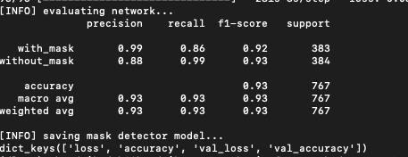
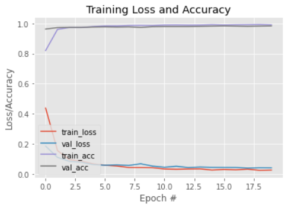

Tech stack / Framework: 
- OpenCV 
- Caffe-based face detector 
- Keras 
- Tensorflow 
- MobileNetV2

Dataset: 
- Consists of 4095 images with two classes: - with_mask - without_mask 
- Images were collected from Kaggle datasets, Bing search API, and RMFD datasets
  - RMFD datasets (https://github.com/X-zhangyang/Real-World-Masked-Face-Dataset)
  - Bing search API code (https://github.com/chandrikadeb7/Face-Mask-Detection/blob/master/search.py)

Training: 
- Pre-process images by setting them to 224x224 dimensions and assign labels (with_mask or without_mask) 
- Convert the data and labels to numpy arrays
- Encode labels via one-hot encoding - Split dataset into training (75%) and testing (25%) 
- Create training image generator for data augmentation using Keras ImageDataGenerator 
- Load MobileNetV2 and ensure head FC layers are left off 
- Construct the head of the model that will be placed on top of the base model 
- Place head FC model on top of base model (this is the actual model that will be trained) 
- Loop over all layers in base model and set their trainable to be False so that they will not be altered/updated during training 
- Compile model using Adam optimizer 
- Train the head of the model 
- Make the predictions based on the testing set 
- Save model to disk, this creates the pre-trained model used in this application "mask_detector.model"
- NOTE: For this implementation, we did not use the code to train our model, we downloaded the pre-trained model from the original author (https://github.com/chandrikadeb7/Face-Mask-Detection/blob/master/train_mask_detector.py)

Performance Evaluation Results (Photos from original repository author: https://github.com/chandrikadeb7/Face-Mask-Detection):





Model Summary:

```
__________________________________________________________________________________________________
Layer (type)                    Output Shape         Param #     Connected to
==================================================================================================
input_1 (InputLayer)            [(None, 224, 224, 3) 0
__________________________________________________________________________________________________
Conv1 (Conv2D)                  (None, 112, 112, 32) 864         input_1[0][0]
__________________________________________________________________________________________________
bn_Conv1 (BatchNormalization)   (None, 112, 112, 32) 128         Conv1[0][0]
__________________________________________________________________________________________________
Conv1_relu (ReLU)               (None, 112, 112, 32) 0           bn_Conv1[0][0]
__________________________________________________________________________________________________
expanded_conv_depthwise (Depthw (None, 112, 112, 32) 288         Conv1_relu[0][0]
__________________________________________________________________________________________________
expanded_conv_depthwise_BN (Bat (None, 112, 112, 32) 128         expanded_conv_depthwise[0][0]
__________________________________________________________________________________________________
expanded_conv_depthwise_relu (R (None, 112, 112, 32) 0           expanded_conv_depthwise_BN[0][0]
__________________________________________________________________________________________________
expanded_conv_project (Conv2D)  (None, 112, 112, 16) 512         expanded_conv_depthwise_relu[0][0
__________________________________________________________________________________________________
expanded_conv_project_BN (Batch (None, 112, 112, 16) 64          expanded_conv_project[0][0]
__________________________________________________________________________________________________
block_1_expand (Conv2D)         (None, 112, 112, 96) 1536        expanded_conv_project_BN[0][0]
__________________________________________________________________________________________________
block_1_expand_BN (BatchNormali (None, 112, 112, 96) 384         block_1_expand[0][0]
__________________________________________________________________________________________________
block_1_expand_relu (ReLU)      (None, 112, 112, 96) 0           block_1_expand_BN[0][0]
__________________________________________________________________________________________________
block_1_pad (ZeroPadding2D)     (None, 113, 113, 96) 0           block_1_expand_relu[0][0]
__________________________________________________________________________________________________
block_1_depthwise (DepthwiseCon (None, 56, 56, 96)   864         block_1_pad[0][0]
__________________________________________________________________________________________________
block_1_depthwise_BN (BatchNorm (None, 56, 56, 96)   384         block_1_depthwise[0][0]
__________________________________________________________________________________________________
block_1_depthwise_relu (ReLU)   (None, 56, 56, 96)   0           block_1_depthwise_BN[0][0]
__________________________________________________________________________________________________
block_1_project (Conv2D)        (None, 56, 56, 24)   2304        block_1_depthwise_relu[0][0]
__________________________________________________________________________________________________
block_1_project_BN (BatchNormal (None, 56, 56, 24)   96          block_1_project[0][0]
__________________________________________________________________________________________________
block_2_expand (Conv2D)         (None, 56, 56, 144)  3456        block_1_project_BN[0][0]
__________________________________________________________________________________________________
block_2_expand_BN (BatchNormali (None, 56, 56, 144)  576         block_2_expand[0][0]
__________________________________________________________________________________________________
block_2_expand_relu (ReLU)      (None, 56, 56, 144)  0           block_2_expand_BN[0][0]
__________________________________________________________________________________________________
block_2_depthwise (DepthwiseCon (None, 56, 56, 144)  1296        block_2_expand_relu[0][0]
__________________________________________________________________________________________________
block_2_depthwise_BN (BatchNorm (None, 56, 56, 144)  576         block_2_depthwise[0][0]
__________________________________________________________________________________________________
block_2_depthwise_relu (ReLU)   (None, 56, 56, 144)  0           block_2_depthwise_BN[0][0]
__________________________________________________________________________________________________
block_2_project (Conv2D)        (None, 56, 56, 24)   3456        block_2_depthwise_relu[0][0]
__________________________________________________________________________________________________
block_2_project_BN (BatchNormal (None, 56, 56, 24)   96          block_2_project[0][0]
__________________________________________________________________________________________________
block_2_add (Add)               (None, 56, 56, 24)   0           block_1_project_BN[0][0]
                                                                 block_2_project_BN[0][0]
__________________________________________________________________________________________________
block_3_expand (Conv2D)         (None, 56, 56, 144)  3456        block_2_add[0][0]
__________________________________________________________________________________________________
block_3_expand_BN (BatchNormali (None, 56, 56, 144)  576         block_3_expand[0][0]
__________________________________________________________________________________________________
block_3_expand_relu (ReLU)      (None, 56, 56, 144)  0           block_3_expand_BN[0][0]
__________________________________________________________________________________________________
block_3_pad (ZeroPadding2D)     (None, 57, 57, 144)  0           block_3_expand_relu[0][0]
__________________________________________________________________________________________________
block_3_depthwise (DepthwiseCon (None, 28, 28, 144)  1296        block_3_pad[0][0]
__________________________________________________________________________________________________
block_3_depthwise_BN (BatchNorm (None, 28, 28, 144)  576         block_3_depthwise[0][0]
__________________________________________________________________________________________________
block_3_depthwise_relu (ReLU)   (None, 28, 28, 144)  0           block_3_depthwise_BN[0][0]
__________________________________________________________________________________________________
block_3_project (Conv2D)        (None, 28, 28, 32)   4608        block_3_depthwise_relu[0][0]
__________________________________________________________________________________________________
block_3_project_BN (BatchNormal (None, 28, 28, 32)   128         block_3_project[0][0]
__________________________________________________________________________________________________
block_4_expand (Conv2D)         (None, 28, 28, 192)  6144        block_3_project_BN[0][0]
__________________________________________________________________________________________________
block_4_expand_BN (BatchNormali (None, 28, 28, 192)  768         block_4_expand[0][0]
__________________________________________________________________________________________________
block_4_expand_relu (ReLU)      (None, 28, 28, 192)  0           block_4_expand_BN[0][0]
__________________________________________________________________________________________________
block_4_depthwise (DepthwiseCon (None, 28, 28, 192)  1728        block_4_expand_relu[0][0]
__________________________________________________________________________________________________
block_4_depthwise_BN (BatchNorm (None, 28, 28, 192)  768         block_4_depthwise[0][0]
__________________________________________________________________________________________________
block_4_depthwise_relu (ReLU)   (None, 28, 28, 192)  0           block_4_depthwise_BN[0][0]
__________________________________________________________________________________________________
block_4_project (Conv2D)        (None, 28, 28, 32)   6144        block_4_depthwise_relu[0][0]
__________________________________________________________________________________________________
block_4_project_BN (BatchNormal (None, 28, 28, 32)   128         block_4_project[0][0]
__________________________________________________________________________________________________
block_4_add (Add)               (None, 28, 28, 32)   0           block_3_project_BN[0][0]
                                                                 block_4_project_BN[0][0]
__________________________________________________________________________________________________
block_5_expand (Conv2D)         (None, 28, 28, 192)  6144        block_4_add[0][0]
__________________________________________________________________________________________________
block_5_expand_BN (BatchNormali (None, 28, 28, 192)  768         block_5_expand[0][0]
__________________________________________________________________________________________________
block_5_expand_relu (ReLU)      (None, 28, 28, 192)  0           block_5_expand_BN[0][0]
__________________________________________________________________________________________________
block_5_depthwise (DepthwiseCon (None, 28, 28, 192)  1728        block_5_expand_relu[0][0]
__________________________________________________________________________________________________
block_5_depthwise_BN (BatchNorm (None, 28, 28, 192)  768         block_5_depthwise[0][0]
__________________________________________________________________________________________________
block_5_depthwise_relu (ReLU)   (None, 28, 28, 192)  0           block_5_depthwise_BN[0][0]
__________________________________________________________________________________________________
block_5_project (Conv2D)        (None, 28, 28, 32)   6144        block_5_depthwise_relu[0][0]
__________________________________________________________________________________________________
block_5_project_BN (BatchNormal (None, 28, 28, 32)   128         block_5_project[0][0]
__________________________________________________________________________________________________
block_5_add (Add)               (None, 28, 28, 32)   0           block_4_add[0][0]
                                                                 block_5_project_BN[0][0]
__________________________________________________________________________________________________
block_6_expand (Conv2D)         (None, 28, 28, 192)  6144        block_5_add[0][0]
__________________________________________________________________________________________________
block_6_expand_BN (BatchNormali (None, 28, 28, 192)  768         block_6_expand[0][0]
__________________________________________________________________________________________________
block_6_expand_relu (ReLU)      (None, 28, 28, 192)  0           block_6_expand_BN[0][0]
__________________________________________________________________________________________________
block_6_pad (ZeroPadding2D)     (None, 29, 29, 192)  0           block_6_expand_relu[0][0]
__________________________________________________________________________________________________
block_6_depthwise (DepthwiseCon (None, 14, 14, 192)  1728        block_6_pad[0][0]
__________________________________________________________________________________________________
block_6_depthwise_BN (BatchNorm (None, 14, 14, 192)  768         block_6_depthwise[0][0]
__________________________________________________________________________________________________
block_6_depthwise_relu (ReLU)   (None, 14, 14, 192)  0           block_6_depthwise_BN[0][0]
__________________________________________________________________________________________________
block_6_project (Conv2D)        (None, 14, 14, 64)   12288       block_6_depthwise_relu[0][0]
__________________________________________________________________________________________________
block_6_project_BN (BatchNormal (None, 14, 14, 64)   256         block_6_project[0][0]
__________________________________________________________________________________________________
block_7_expand (Conv2D)         (None, 14, 14, 384)  24576       block_6_project_BN[0][0]
__________________________________________________________________________________________________
block_7_expand_BN (BatchNormali (None, 14, 14, 384)  1536        block_7_expand[0][0]
__________________________________________________________________________________________________
block_7_expand_relu (ReLU)      (None, 14, 14, 384)  0           block_7_expand_BN[0][0]
__________________________________________________________________________________________________
block_7_depthwise (DepthwiseCon (None, 14, 14, 384)  3456        block_7_expand_relu[0][0]
__________________________________________________________________________________________________
block_7_depthwise_BN (BatchNorm (None, 14, 14, 384)  1536        block_7_depthwise[0][0]
__________________________________________________________________________________________________
block_7_depthwise_relu (ReLU)   (None, 14, 14, 384)  0           block_7_depthwise_BN[0][0]
__________________________________________________________________________________________________
block_7_project (Conv2D)        (None, 14, 14, 64)   24576       block_7_depthwise_relu[0][0]
__________________________________________________________________________________________________
block_7_project_BN (BatchNormal (None, 14, 14, 64)   256         block_7_project[0][0]
__________________________________________________________________________________________________
block_7_add (Add)               (None, 14, 14, 64)   0           block_6_project_BN[0][0]
                                                                 block_7_project_BN[0][0]
__________________________________________________________________________________________________
block_8_expand (Conv2D)         (None, 14, 14, 384)  24576       block_7_add[0][0]
__________________________________________________________________________________________________
block_8_expand_BN (BatchNormali (None, 14, 14, 384)  1536        block_8_expand[0][0]
__________________________________________________________________________________________________
block_8_expand_relu (ReLU)      (None, 14, 14, 384)  0           block_8_expand_BN[0][0]
__________________________________________________________________________________________________
block_8_depthwise (DepthwiseCon (None, 14, 14, 384)  3456        block_8_expand_relu[0][0]
__________________________________________________________________________________________________
block_8_depthwise_BN (BatchNorm (None, 14, 14, 384)  1536        block_8_depthwise[0][0]
__________________________________________________________________________________________________
block_8_depthwise_relu (ReLU)   (None, 14, 14, 384)  0           block_8_depthwise_BN[0][0]
__________________________________________________________________________________________________
block_8_project (Conv2D)        (None, 14, 14, 64)   24576       block_8_depthwise_relu[0][0]
__________________________________________________________________________________________________
block_8_project_BN (BatchNormal (None, 14, 14, 64)   256         block_8_project[0][0]
__________________________________________________________________________________________________
block_8_add (Add)               (None, 14, 14, 64)   0           block_7_add[0][0]
                                                                 block_8_project_BN[0][0]
__________________________________________________________________________________________________
block_9_expand (Conv2D)         (None, 14, 14, 384)  24576       block_8_add[0][0]
__________________________________________________________________________________________________
block_9_expand_BN (BatchNormali (None, 14, 14, 384)  1536        block_9_expand[0][0]
__________________________________________________________________________________________________
block_9_expand_relu (ReLU)      (None, 14, 14, 384)  0           block_9_expand_BN[0][0]
__________________________________________________________________________________________________
block_9_depthwise (DepthwiseCon (None, 14, 14, 384)  3456        block_9_expand_relu[0][0]
__________________________________________________________________________________________________
block_9_depthwise_BN (BatchNorm (None, 14, 14, 384)  1536        block_9_depthwise[0][0]
__________________________________________________________________________________________________
block_9_depthwise_relu (ReLU)   (None, 14, 14, 384)  0           block_9_depthwise_BN[0][0]
__________________________________________________________________________________________________
block_9_project (Conv2D)        (None, 14, 14, 64)   24576       block_9_depthwise_relu[0][0]
__________________________________________________________________________________________________
block_9_project_BN (BatchNormal (None, 14, 14, 64)   256         block_9_project[0][0]
__________________________________________________________________________________________________
block_9_add (Add)               (None, 14, 14, 64)   0           block_8_add[0][0]
                                                                 block_9_project_BN[0][0]
__________________________________________________________________________________________________
block_10_expand (Conv2D)        (None, 14, 14, 384)  24576       block_9_add[0][0]
__________________________________________________________________________________________________
block_10_expand_BN (BatchNormal (None, 14, 14, 384)  1536        block_10_expand[0][0]
__________________________________________________________________________________________________
block_10_expand_relu (ReLU)     (None, 14, 14, 384)  0           block_10_expand_BN[0][0]
__________________________________________________________________________________________________
block_10_depthwise (DepthwiseCo (None, 14, 14, 384)  3456        block_10_expand_relu[0][0]
__________________________________________________________________________________________________
block_10_depthwise_BN (BatchNor (None, 14, 14, 384)  1536        block_10_depthwise[0][0]
__________________________________________________________________________________________________
block_10_depthwise_relu (ReLU)  (None, 14, 14, 384)  0           block_10_depthwise_BN[0][0]
__________________________________________________________________________________________________
block_10_project (Conv2D)       (None, 14, 14, 96)   36864       block_10_depthwise_relu[0][0]
__________________________________________________________________________________________________
block_10_project_BN (BatchNorma (None, 14, 14, 96)   384         block_10_project[0][0]
__________________________________________________________________________________________________
block_11_expand (Conv2D)        (None, 14, 14, 576)  55296       block_10_project_BN[0][0]
__________________________________________________________________________________________________
block_11_expand_BN (BatchNormal (None, 14, 14, 576)  2304        block_11_expand[0][0]
__________________________________________________________________________________________________
block_11_expand_relu (ReLU)     (None, 14, 14, 576)  0           block_11_expand_BN[0][0]
__________________________________________________________________________________________________
block_11_depthwise (DepthwiseCo (None, 14, 14, 576)  5184        block_11_expand_relu[0][0]
__________________________________________________________________________________________________
block_11_depthwise_BN (BatchNor (None, 14, 14, 576)  2304        block_11_depthwise[0][0]
__________________________________________________________________________________________________
block_11_depthwise_relu (ReLU)  (None, 14, 14, 576)  0           block_11_depthwise_BN[0][0]
__________________________________________________________________________________________________
block_11_project (Conv2D)       (None, 14, 14, 96)   55296       block_11_depthwise_relu[0][0]
__________________________________________________________________________________________________
block_11_project_BN (BatchNorma (None, 14, 14, 96)   384         block_11_project[0][0]
__________________________________________________________________________________________________
block_11_add (Add)              (None, 14, 14, 96)   0           block_10_project_BN[0][0]
                                                                 block_11_project_BN[0][0]
__________________________________________________________________________________________________
block_12_expand (Conv2D)        (None, 14, 14, 576)  55296       block_11_add[0][0]
__________________________________________________________________________________________________
block_12_expand_BN (BatchNormal (None, 14, 14, 576)  2304        block_12_expand[0][0]
__________________________________________________________________________________________________
block_12_expand_relu (ReLU)     (None, 14, 14, 576)  0           block_12_expand_BN[0][0]
__________________________________________________________________________________________________
block_12_depthwise (DepthwiseCo (None, 14, 14, 576)  5184        block_12_expand_relu[0][0]
__________________________________________________________________________________________________
block_12_depthwise_BN (BatchNor (None, 14, 14, 576)  2304        block_12_depthwise[0][0]
__________________________________________________________________________________________________
block_12_depthwise_relu (ReLU)  (None, 14, 14, 576)  0           block_12_depthwise_BN[0][0]
__________________________________________________________________________________________________
block_12_project (Conv2D)       (None, 14, 14, 96)   55296       block_12_depthwise_relu[0][0]
__________________________________________________________________________________________________
block_12_project_BN (BatchNorma (None, 14, 14, 96)   384         block_12_project[0][0]
__________________________________________________________________________________________________
block_12_add (Add)              (None, 14, 14, 96)   0           block_11_add[0][0]
                                                                 block_12_project_BN[0][0]
__________________________________________________________________________________________________
block_13_expand (Conv2D)        (None, 14, 14, 576)  55296       block_12_add[0][0]
__________________________________________________________________________________________________
block_13_expand_BN (BatchNormal (None, 14, 14, 576)  2304        block_13_expand[0][0]
__________________________________________________________________________________________________
block_13_expand_relu (ReLU)     (None, 14, 14, 576)  0           block_13_expand_BN[0][0]
__________________________________________________________________________________________________
block_13_pad (ZeroPadding2D)    (None, 15, 15, 576)  0           block_13_expand_relu[0][0]
__________________________________________________________________________________________________
block_13_depthwise (DepthwiseCo (None, 7, 7, 576)    5184        block_13_pad[0][0]
__________________________________________________________________________________________________
block_13_depthwise_BN (BatchNor (None, 7, 7, 576)    2304        block_13_depthwise[0][0]
__________________________________________________________________________________________________
block_13_depthwise_relu (ReLU)  (None, 7, 7, 576)    0           block_13_depthwise_BN[0][0]
__________________________________________________________________________________________________
block_13_project (Conv2D)       (None, 7, 7, 160)    92160       block_13_depthwise_relu[0][0]
__________________________________________________________________________________________________
block_13_project_BN (BatchNorma (None, 7, 7, 160)    640         block_13_project[0][0]
__________________________________________________________________________________________________
block_14_expand (Conv2D)        (None, 7, 7, 960)    153600      block_13_project_BN[0][0]
__________________________________________________________________________________________________
block_14_expand_BN (BatchNormal (None, 7, 7, 960)    3840        block_14_expand[0][0]
__________________________________________________________________________________________________
block_14_expand_relu (ReLU)     (None, 7, 7, 960)    0           block_14_expand_BN[0][0]
__________________________________________________________________________________________________
block_14_depthwise (DepthwiseCo (None, 7, 7, 960)    8640        block_14_expand_relu[0][0]
__________________________________________________________________________________________________
block_14_depthwise_BN (BatchNor (None, 7, 7, 960)    3840        block_14_depthwise[0][0]
__________________________________________________________________________________________________
block_14_depthwise_relu (ReLU)  (None, 7, 7, 960)    0           block_14_depthwise_BN[0][0]
__________________________________________________________________________________________________
block_14_project (Conv2D)       (None, 7, 7, 160)    153600      block_14_depthwise_relu[0][0]
__________________________________________________________________________________________________
block_14_project_BN (BatchNorma (None, 7, 7, 160)    640         block_14_project[0][0]
__________________________________________________________________________________________________
block_14_add (Add)              (None, 7, 7, 160)    0           block_13_project_BN[0][0]
                                                                 block_14_project_BN[0][0]
__________________________________________________________________________________________________
block_15_expand (Conv2D)        (None, 7, 7, 960)    153600      block_14_add[0][0]
__________________________________________________________________________________________________
block_15_expand_BN (BatchNormal (None, 7, 7, 960)    3840        block_15_expand[0][0]
__________________________________________________________________________________________________
block_15_expand_relu (ReLU)     (None, 7, 7, 960)    0           block_15_expand_BN[0][0]
__________________________________________________________________________________________________
block_15_depthwise (DepthwiseCo (None, 7, 7, 960)    8640        block_15_expand_relu[0][0]
__________________________________________________________________________________________________
block_15_depthwise_BN (BatchNor (None, 7, 7, 960)    3840        block_15_depthwise[0][0]
__________________________________________________________________________________________________
block_15_depthwise_relu (ReLU)  (None, 7, 7, 960)    0           block_15_depthwise_BN[0][0]
__________________________________________________________________________________________________
block_15_project (Conv2D)       (None, 7, 7, 160)    153600      block_15_depthwise_relu[0][0]
__________________________________________________________________________________________________
block_15_project_BN (BatchNorma (None, 7, 7, 160)    640         block_15_project[0][0]
__________________________________________________________________________________________________
block_15_add (Add)              (None, 7, 7, 160)    0           block_14_add[0][0]
                                                                 block_15_project_BN[0][0]
__________________________________________________________________________________________________
block_16_expand (Conv2D)        (None, 7, 7, 960)    153600      block_15_add[0][0]
__________________________________________________________________________________________________
block_16_expand_BN (BatchNormal (None, 7, 7, 960)    3840        block_16_expand[0][0]
__________________________________________________________________________________________________
block_16_expand_relu (ReLU)     (None, 7, 7, 960)    0           block_16_expand_BN[0][0]
__________________________________________________________________________________________________
block_16_depthwise (DepthwiseCo (None, 7, 7, 960)    8640        block_16_expand_relu[0][0]
__________________________________________________________________________________________________
block_16_depthwise_BN (BatchNor (None, 7, 7, 960)    3840        block_16_depthwise[0][0]
__________________________________________________________________________________________________
block_16_depthwise_relu (ReLU)  (None, 7, 7, 960)    0           block_16_depthwise_BN[0][0]
__________________________________________________________________________________________________
block_16_project (Conv2D)       (None, 7, 7, 320)    307200      block_16_depthwise_relu[0][0]
__________________________________________________________________________________________________
block_16_project_BN (BatchNorma (None, 7, 7, 320)    1280        block_16_project[0][0]
__________________________________________________________________________________________________
Conv_1 (Conv2D)                 (None, 7, 7, 1280)   409600      block_16_project_BN[0][0]
__________________________________________________________________________________________________
Conv_1_bn (BatchNormalization)  (None, 7, 7, 1280)   5120        Conv_1[0][0]
__________________________________________________________________________________________________
out_relu (ReLU)                 (None, 7, 7, 1280)   0           Conv_1_bn[0][0]
__________________________________________________________________________________________________
average_pooling2d (AveragePooli (None, 1, 1, 1280)   0           out_relu[0][0]
__________________________________________________________________________________________________
flatten (Flatten)               (None, 1280)         0           average_pooling2d[0][0]
__________________________________________________________________________________________________
dense (Dense)                   (None, 128)          163968      flatten[0][0]
__________________________________________________________________________________________________
dropout (Dropout)               (None, 128)          0           dense[0][0]
__________________________________________________________________________________________________
dense_1 (Dense)                 (None, 2)            258         dropout[0][0]
==================================================================================================
Total params: 2,422,210
Trainable params: 164,226
Non-trainable params: 2,257,984
__________________________________________________________________________________________________

```

For more details on the implementation of this model, please refer to https://github.com/chandrikadeb7/Face-Mask-Detection