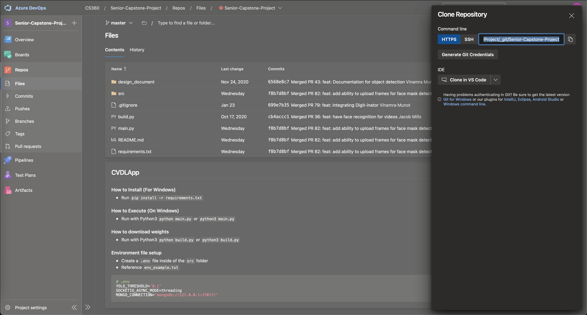

### Commands required to run the application on Dr. Wang's server
1. git clone https://CS360@dev.azure.com/CS360/Senior-Capstone-Project/_git/Senior-Capstone-Project

2. Refer [Login Access](#login-token) to get the password to clone the repo. Click on `Generate Git Credential` to get the token
3. python3 -m virtualenv Senior-Capstone-Project
4. cd Senior-Capstone-Project
5. source bin/activate
6. pip3 install -r requirements.txt
7. python3 build.py
8. python3 main.py
---
### Login Token

