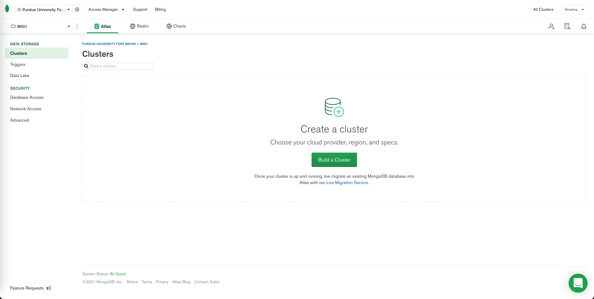
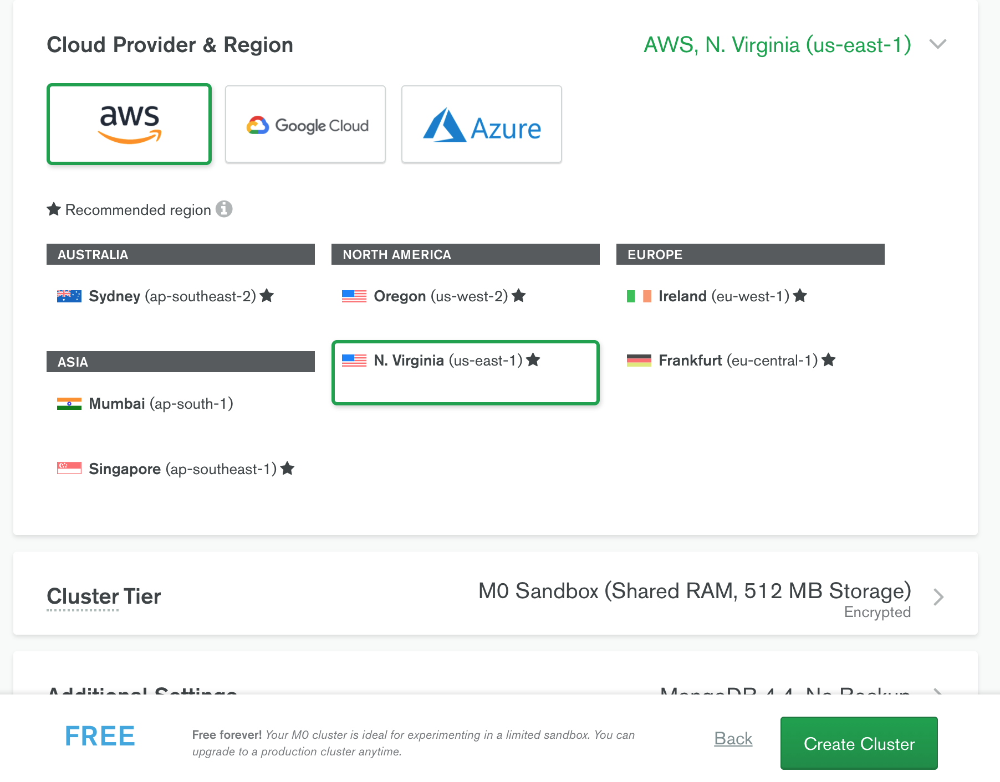

### Mongodb free signup

1. Please visit [Mongodb](https://www.mongodb.com/cloud/atlas/register) and create an account using pfw email.
2. Login to [Mongo Cloud](https://account.mongodb.com/account/login)
3. Click on the button "Build a Cluster" [Image](#mongodb-image)
4. Select the "Shared Cluster" option that contains the free cluster [Image](#mongodb-image)
5. Select the cloud provider as AWS and then click on "Create Cluster" [Image](#mongodb-image)
6. Click on "connect" button in the sandbox [Image](#mongodb-image)
7. Click on "Connect your application" and then select Driver as "Python" and the version "3.11 or later" and then copy the connection string. [Image](#mongodb-image)
8. Place that connection string inside of the .env file as mentioned in [env file setup](#environment-file-setup)
9. Add a user in the database access [Image](#mongodb-image)
10. Use that same the username and password and replace the fields for username and password in the connections string:
`mongodb+srv://<username>:<password>@cluster0.vypct.mongodb.net/test?retryWrites=true&w=majority`
11. paste this string in the .env file under MONGO_CONNECTION

### Mongodb Image 

1. 
2. 
3. 
4. 
5. 
6. 