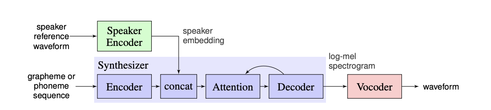

# Voice Cloning

Our web project uses [Voice Cloning by CoretinJ](https://github.com/CorentinJ/Real-Time-Voice-Cloning) which is an implementation of [Transfer Learning from Speaker Verification to Multispeaker Text-To-Speech Synthesis](https://arxiv.org/pdf/1806.04558.pdf) (SV2TTS) with a vocoder that works in real-time.

SV2TTS is a three-stage deep learning framework that allows to create a numerical representation of a voice from a few seconds of audio, and to use it to condition a text-to-speech model trained to generalize to new voices.

The three independently trained components:
1. A speaker encoder network, trained on a speaker verification task using an independent dataset of noisy speech without transcripts from thousands of speakers, to generate a fixed-dimensional embedding vector from only seconds of reference speech from a target speaker
2. A sequence-to-sequence synthesis network based on Tacotron 2 that generates a mel spectrogram from text, conditioned on the speaker embedding
3. An auto-regressive WaveNet-based vocoder network that converts the mel spectrogram into time domain waveform samples

We demonstrate that the proposed model is able to transfer the knowledge of speaker variability learned by the discriminatively-trained speaker encoder to the multispeaker TTS task, and is able to synthesize natural speech from speakers unseen during training.

---

# Processing

> File: `voice_cloning.py` under `services` folder

> Code Explanation:

1. The first three imports are of the three models that are required to process audio and text for synthesis: the `models/encoder`, `models/vocoder` and `models/synthesizer`. 
2. The three global variables `encoder_path`, `syn_model_path`, and `voc_model_fpath` are the path for the pretrained models. 
3. Then entering the function `def voice_cloning(audioFilePath, text)` takes the audio file path that is saved on the server and the text that is written in the text box on the client side.
4. Then all the three models from step 2 are loaded to a variable
5. `librosa.load()` takes the parameter as the path of the audio file and return the audio time series in form of numpy arrays as `original_wav` and the `sampling_rate`
6. `encoder.embed_utterance()` returns the embedding as a numpy array of float32 of shape (model_embedding_size,).
7. `synthesizer.synthesize_spectrograms()[0]` returns the first of N melspectrograms as numpy arrays of shape (80, Mi), where Mi is the sequence length of spectrogram i.
8. `vocoder.infer_waveform()` takes the melspectrogram from the previous step and then infer the waveform by the synthesizer and then return the generated model wav for the input audio provided and the text.
9. Then the base64 of the audio is returned back to the client side.

---

## References

[Voice Cloning by CoretinJ](https://github.com/CorentinJ/Real-Time-Voice-Cloning)

[Transfer Learning from Speaker Verification to
Multispeaker Text-To-Speech Synthesis](https://arxiv.org/pdf/1806.04558.pdf)